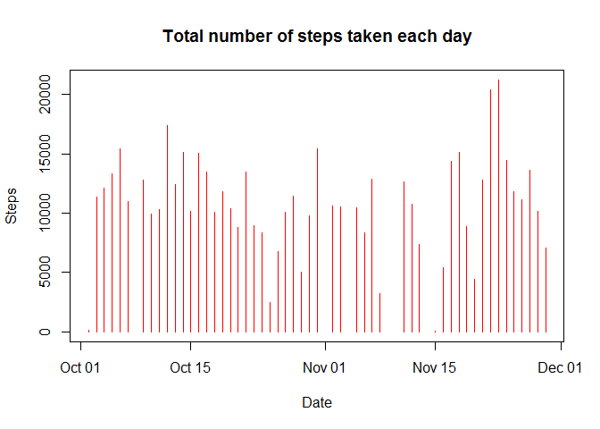
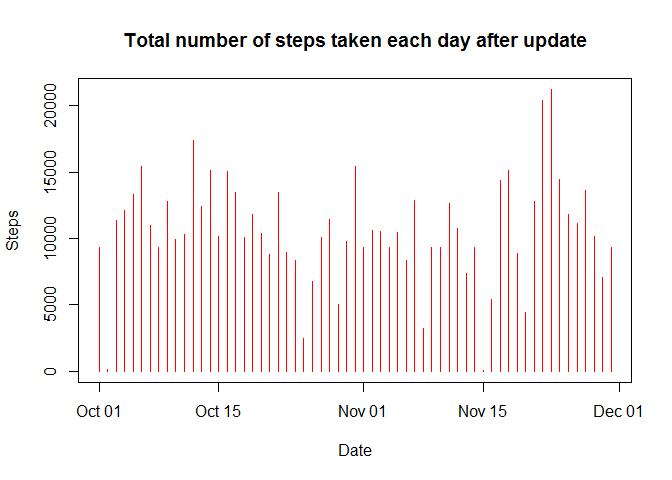
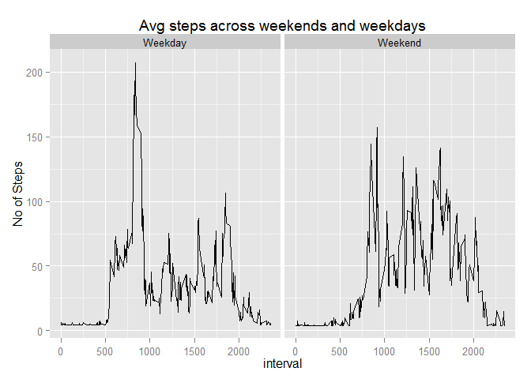

# Reproducible Research - Peer Assignment 1
Monday, August 17, 2014  

####Loading and processing data

```r
 activity <- read.csv("activity.csv")
 activity$date <- as.Date(activity$date)
 noOfRows <- nrow(activity)
 str(activity)
```

```
## 'data.frame':	17568 obs. of  3 variables:
##  $ steps   : int  NA NA NA NA NA NA NA NA NA NA ...
##  $ date    : Date, format: "2012-10-01" "2012-10-01" ...
##  $ interval: int  0 5 10 15 20 25 30 35 40 45 ...
```

####What is mean total number of steps taken per day?

```r
 # Aggregate(sum) the activity data steps by date
 activitySum <- aggregate(steps~date,activity,sum,na.rm=TRUE)

 
 #plot the histogram steps by day
 plot(activitySum$date,activitySum$steps, type="h",col="red",main="Total number of steps taken each day", xlab="Date", ylab="Steps")
```

 

```r
 # Mean number of days per day
 mean(activitySum$steps)
```

```
## [1] 10766
```

```r
 # Median number of days per day
 median(activitySum$steps)
```

```
## [1] 10765
```
####What is the average daily activity pattern?


```r
#aggregate(mean) the activity data steps by interval
activityAvg <-aggregate(activity$steps, by=list(interval=activity$interval),FUN ="mean" ,na.rm=TRUE)

#time series plot
 plot(activityAvg$interval,activityAvg$x, type="l",col="red",main="Average daily activity pattern", xlab="Interval",ylab="Steps")
```

 

####Transform the data

```r
 totalRows<- nrow(activity)
 NArows <- nrow(na.omit(activity))

 #Total number of missing values in the activity dataset
 totalRows - NArows
```

```
## [1] 2304
```

```r
 #Strategy for inputing missing data
 #Step1:Sum the total activiy for rows with no NA rows
 #Step2:Divide sum total acitiviy by toal no of rows in activity file including   NA rows to get average steps
 #Step3:Replace the rows with NA with averge steps

 avgSteps <-  (sum(activity$steps,na.rm=TRUE))/ totalRows
 activityUpd <- activity
 activityUpd$date <- as.Date(activityUpd$date)
 activityUpd$steps[which(is.na(activityUpd$steps)==TRUE)] <- avgSteps

 
 activityUpdSum <- aggregate(steps~date,activityUpd,sum,na.rm=TRUE)

 #Plot after inputing the missing vlaues
 plot(activityUpdSum$date,activityUpdSum$steps, type="h",col="red",main="Total number of steps taken each day after update", xlab="Date", ylab="Steps")

 
 #The values are low low compared to before updating NA values
 #mean activity steps per day after update
 mean(activityUpdSum$steps)
```

```
## [1] 10581
```

```r
 #median acitivity steps per day after update  
 median(activityUpdSum$steps)
```

```
## [1] 10395
```

```r
 activityUpd$weekday <- weekdays(as.Date(activityUpd$date))

 #Update to weekday/weekend based on weekday values
 for (i in 1:nrow(activityUpd))
      {
        activityUpd$dayType[i] = if (activityUpd$weekday[i] %in% c("Saturday","Sunday")) { "Weekend"} else {"Weekday"}
      }  
       
#change daytype tp factor 
activityUpd$dayType <- as.factor(activityUpd$dayType)
 
 #Aggregate(mean) steps by interval and daytype  
  activityUpdAvg <- aggregate(activityUpd$steps,by=list(interval=activityUpd$interval,dayType=activityUpd$dayType),FUN=mean)

library(ggplot2)
```

```
## Warning: package 'ggplot2' was built under R version 3.0.3
```

 

```r
#plot the graph
 g<- ggplot(activityUpdAvg,aes(interval,x))
  g + geom_line() + facet_grid(.~dayType) + labs(title = "Avg steps across weekends and weekdays") + labs(y="No of Steps")
```

 

 
